# The NASDAQ Composite, S&P 500 and the Dow in 2020

This project, conducted with Python and its data analysis libraries such as Pandas and Matplotlib, evaluates and compares performance of the Nasdaq Composite, S&P 500 index, and the Dow in 2020. Historical data are sourced from MarketWatch, a subsidiary of Dow Jones & Company and a property of News Corp.

PDF report of this project can be found [here](2020 Composite Index US - Trang Ha Nguyen (Helen).pdf).

:exclamation: :exclamation: :exclamation: Click **Reload** when Jupyter Notebook is not properly loaded for preview. :exclamation: :exclamation: :exclamation:

### Overview

2020 was a year of uncertainty and financial hardships, even more so with a sudden major stock market crash caused by the coronavirus that began on February 20th, 2020 and ended on April 7th. Therefore, it may be worth investigating some major stock indices to gauge the magnitude of the impact inflicted by the pandemic on the US stock market.

Nasdaq Composite (~3000 stocks), S&P 500 index (500 stocks), and the Dow (30 stocks) are known as major stock market indices measuring the performance of a stock market, or a subset of the stock market. Each calculation for an index varies because each covers different stocks. The Nasdaq Composite (ticker symbol ^IXIC) is a stock market index that includes almost all stocks listed on the Nasdaq stock exchange. The composition of the Nasdaq Composite is heavily weighted towards companies in the information technology sector. The Nasdaq-100, which includes 100 of the largest non-financial companies in the Nasdaq Composite, accounts for over 90% of the movement of the Nasdaq Composite.

The Standard and Poor's 500, also known as the S&P 500 (ticker symbol ^GSPC), is a stock market index tracking the stock performance of the 500 largest listed companies in the United States. It is widely followed for being one of the best representations of the US stock market and economy. The 10 largest companies in the index, in order of weighting, are Apple Inc., Microsoft, Amazon.com, Facebook, Alphabet Inc., Tesla, Inc., Berkshire Hathaway, JPMorgan Chase & Co., and Johnson & Johnson.

The Dow Jones Industrial Average or simply the Dow (ticker symbol ^DJI) is a stock market index of 30 large listed companies in the United States, where the number 30 is because few American stocks existed when the index was created in the late 1800s. 

In sum, the Nasdaq Composite is for tech, S&P 500 index is for a broad understanding of the US economy, and the Dow measures the movements of the leading companies in the United States that engage in industrial activities.

### Procedure

Step 1: Data Understanding & Preparation

Step 2: Data Analysis

Step 3: Evaluation

### Data Understanding & Preparation

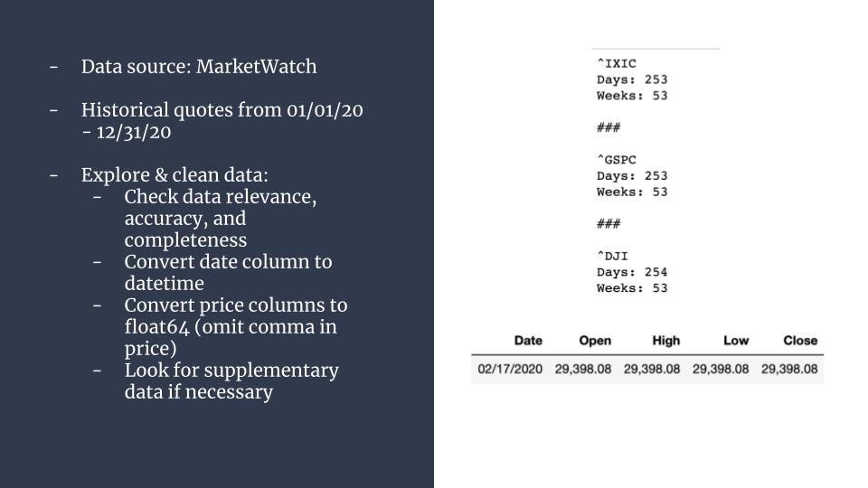

The federal holiday, which dates back to 1885, occurs on the third Monday of February. U.S. exchanges are closed for Presidents Day 2020, which falls on February 17 this year. The New York Stock Exchange, Nasdaq, and bond markets will resume trading at their normal hours on Tuesday, February 18.

### Data Analysis

Technical analysis is employed in this simple stock analysis project to assess how the stock indices have performed in 2020 with little attention given to the value of the company.

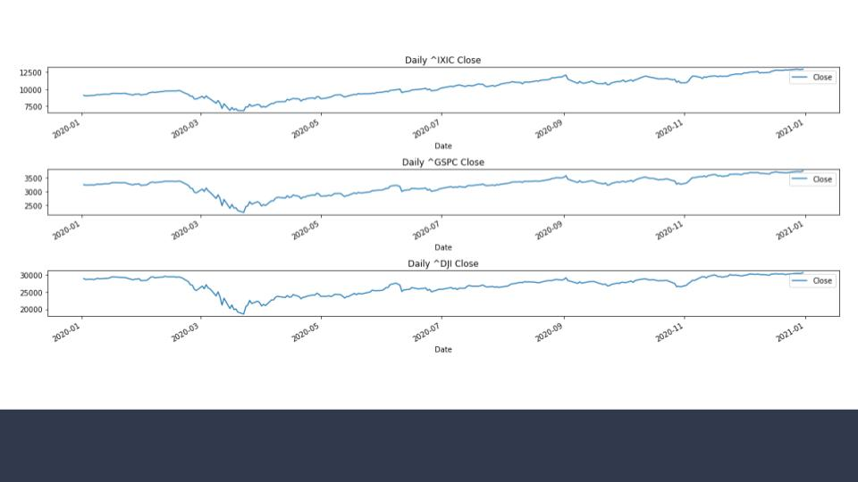

Line chart communicates a stock’s price action very quickly and simply without any significant detail. As a long-term investor, you want your price chart rising from bottom left to top right. That means the stock is rising in price over time. As a short-term investor staying in a stock for weeks or months, you still want the same price action, but you’re looking to exit before the long-term investor does.

Why is a Stock’s Closing Price Significant? A stock’s closing price that determines how a share performs during the day. The close price is considered the reference point for any time frame. It’s the price traders agreed on after all the action throughout the day. When researching historical stock price data, most will use the closing price as the standard measure of the stock’s value as of a specific date. Especially, a stock’s closing price on December 31 in any year is also the closing price for not only that day, but also that week, month, quarter, and year.

**Stock Returns in 2020**

The difference between a stock’s open and close divided by the open is its stock return or its performance in percentage terms. To take a longer-term view of a stock’s performance, such as one-year, we will use the closing price from a year ago and compare it to the closing price from today to get the annual return.

NASDAQ Composite (^IXIC) grows by 42.58 percent.
- Mean Difference between Open and Close of NASDAQ Composite (^IXIC): $5.82

S&P 500 (^GSPC) grows by 15.76 percent.
- Mean Difference between Open and Close of S&P 500 (^GSPC): $0.11

Dow Jones Industrial Average (^DJI) grows by 6.87 percent.
- Mean Difference between Open and Close of Dow Jones Industrial Average (^DJI): $-3.43

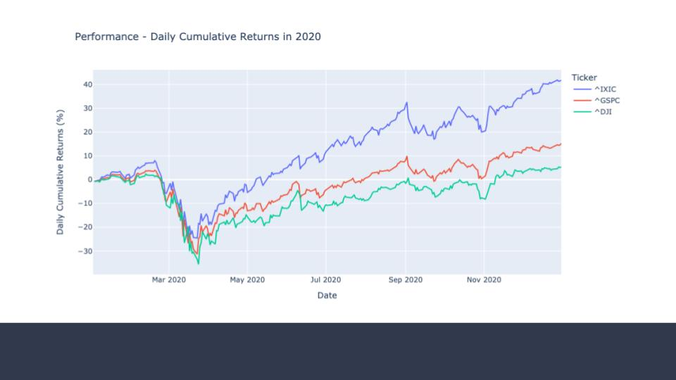

A cumulative return on an investment is the aggregate amount that the investment has gained or lost over time in percentage. In this simple project, the raw closing price is used to calculate the cumulative return.

The cumulative return usually grows over time, so it tends to make older stocks and funds look impressive. It follows that the cumulative return is not a good way to compare investments unless they launched at the same time. An example of cumulative return is investing $10,000 in a company's stock for a 10-year period that results in $66,000. With no taxes and no dividends reinvested, there is a cumulative return of 560%.

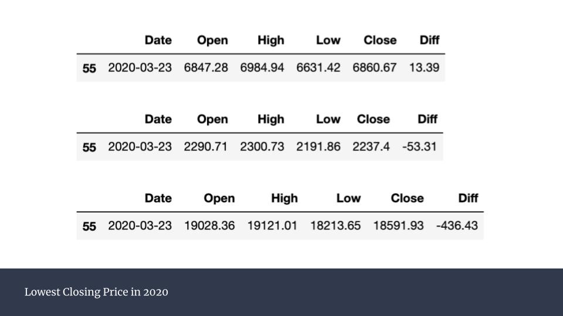

The 2020 stock market crash began just as the World Health Organization moved to declare COVID-19 an official pandemic.

The market climbed higher on a combination of unprecedented fiscal and monetary stimulus in response to the pandemic, as well as hopes for a swift economic rebound.

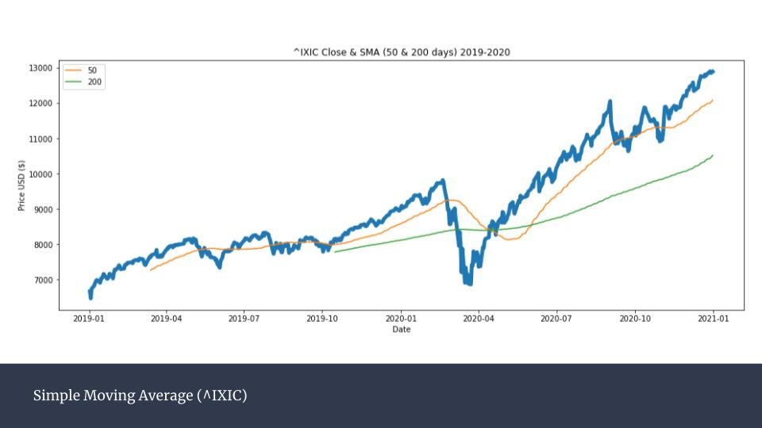

Moving averages are plotted on stock charts to help smooth out period-to-period price fluctuation and highlight overall trend direction. The longer the time period that you chart a moving average, the smoother it becomes, since each additional data point becomes less meaningful because there are more points before it.

Most growth investors like to see moving averages trending up and they like to see the stock’s current price continually close above the trailing average. This is a sign the stock is on the right track to continue rising in price.

In this chart, the orange line is the 50-day moving average, represents the average price over the previous 50 trading sessions, and is calculated by summing the closing price over the last 50 trading sessions and dividing by 50. 

The green line is the 200-day moving average. It represents the average price over the previous 200 trading sessions and is calculated by summing the closing price over the last 200 trading sessions and dividing by 200.

The 200-day moving average is considered especially significant in stock trading. As long as the 50-day moving average of a stock price remains above the 200-day moving average, the stock is generally thought to be in a bullish trend.

If the short-term average is below the long-term average, but at some point, it crosses that graph and becomes higher, that intersection is called a golden cross. The golden cross occurs when the 50-day moving average of a stock crosses above its 200-day moving average. The golden cross, in direct contrast to the cross of death when the short-term moving average descends below the long-term moving average, is a strong bullish market signal, indicating the start of a long-term uptrend. Analysts that look for this pattern consider a positive golden cross to be a signal that the stock or other asset's price is headed higher. 

The idea behind a golden cross is that if an investment's performance is continuing to lag, both the 50-day and the 200-day averages should stay about the same distance from each other. If the 50-day average picks up and crosses the longer-term average, it's a sign that the investment's price has started to increase and that there could be further upward momentum.

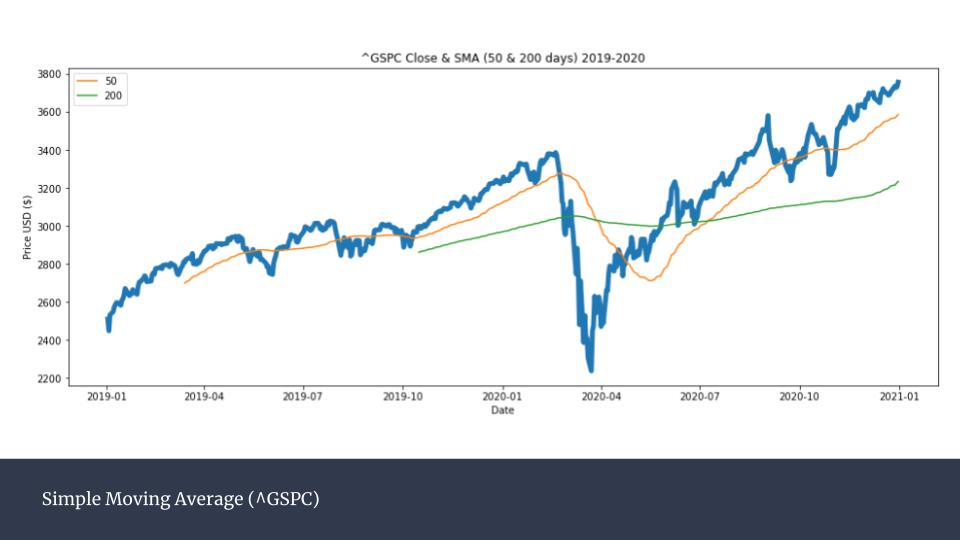

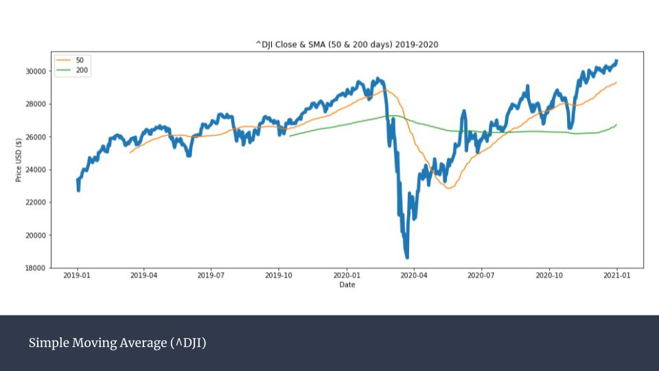

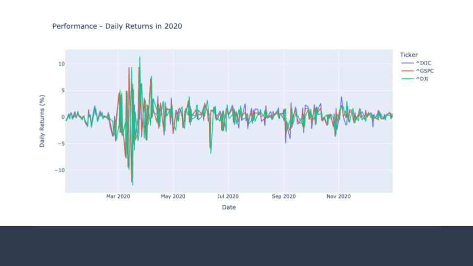

Stock prices change on a daily basis, altering the value of your investments. Daily stock return is calculated to monitor the magnitude of this change. 

A return can be understood as the money made or lost on an investment over some period of time. Returns exhibit more attractive statistical properties than asset prices themselves. Therefore it also makes more statistical sense to analyze return data rather than price series.

The daily return measures the dollar change in a stock’s price as a percentage of the previous day’s closing price. A positive return means the stock has grown in value, while a negative return means it has lost value. A stock with lower positive and negative daily returns is typically less risky than a stock with higher daily returns, which create larger swings in value.

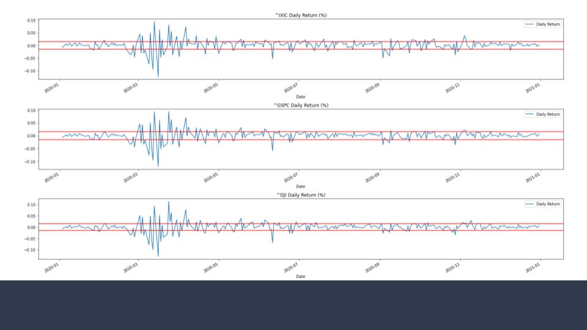

The indicator ‘three weeks tight’ is when the closing prices remain within 1.5% (0.015) of each other for three consecutive weeks. This behavior suggests overall demand for the stock is exceptionally high. If the difference between each weekly close exceeds 1.5%, the three-weeks-tight pattern likely has flaws.

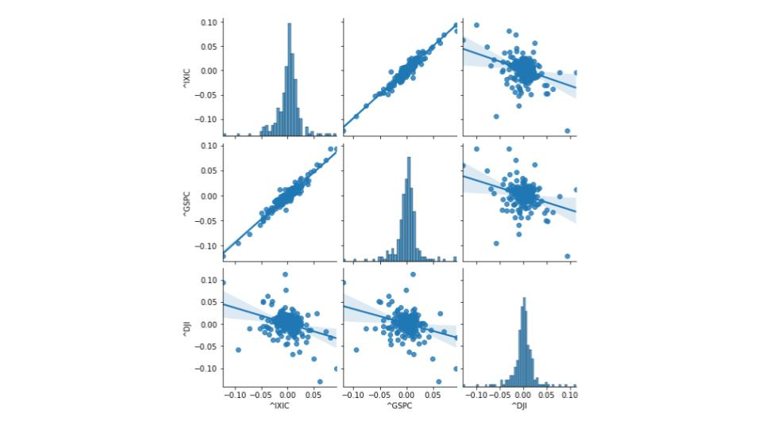

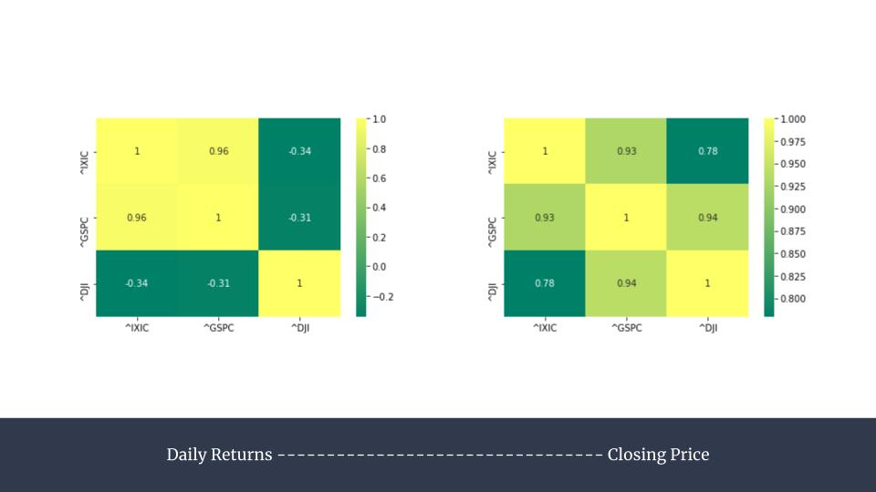

The Nasdaq Composite is as old as the exchange and is different from another popular index, the Nasdaq-100. The Nasdaq-100 comprises of the top 100 non-financial companies listed on the Nasdaq exchange and accounts for over 90% of the movement of the Nasdaq Composite.

At the same time, around 80% of the companies in the Nasdaq-100 are also in the S&P 500. That hasn't always been the case. Fifteen years ago, the overlap was less than 50%.

### Evaluation

Compare our project's analysis outcome with **Analyst Recommendations**

Our analysis has provided us with the figures of stock returns for the three indices in 2020: NASDAQ Composite (^IXIC) grows by 42.58 percent, S&P 500 (^GSPC) grows by 15.76 percent, and Dow Jones Industrial Average (^DJI) grows by 6.87 percent.

Investors typically use analyst recommendations in conjunction with their own stock analysis: The Dow Jones Industrial Average generated a 9.7% total return including dividends, trailing the 18.4% return for the S&P 500 index and far behind 45% advance of the Nasdaq Composite. The economy’s nascent recovery gets much of the credit for the market’s gains, as does a federal stimulus package, massive amounts of liquidity from the Federal Reserve and the rapid development of multiple Covid-19 vaccines.

Total return including dividends:
- Nasdaq Composite: 45%
- The S&P 500 index: 18.4%
- The Dow Jones Industrial Average: 9.7%

Hence, we can see that our statistical analysis shares similar result with standard market analysis (created by taking into consideration a wide range of financial indicators). Thus, we can trust the reliability of the analysis of this project.

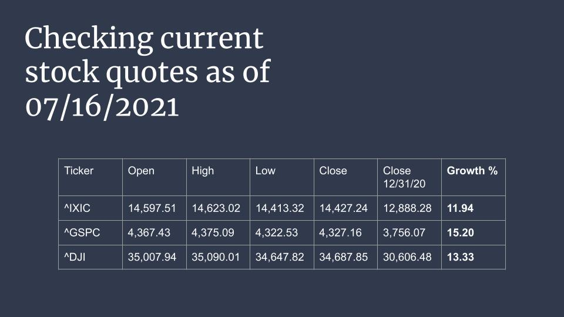

Technology companies continue to post impressive gains, while industries hard hit by the pandemic recover impressively.

After crashing in 2020, energy stocks in 2021 continue to head up ^GSPC's gains, with top-performer Marathon Oil up nearly 100%, while Diamondback Energy, Occidental Petroleum and Nucor have all jumped at least 78%; 6 of the ^GSPC's top 10 stocks this year are in the energy sector. The financial sector is year 2021's second-best performing in the ^GSPC (up 24%), while real estate and communication services follow closely behind—climbing 23% and 19%, respectively.

Though energy and financial stocks headed up the market at the start of 2021, technology stocks have also bounced back after underperforming this spring amid accelerating economic growth and the threat of rising interest rates. Those fears spurred a stock market rotation away from growth stocks (like those in tech) to cyclical and value-leaning slices of the market that struggled during the pandemic (like energy and financials). As of July 2021, however, Federal Reserve officials have made it clear the Fed isn't looking to hike interest rates anytime soon.

*Thank you for your attention!*
